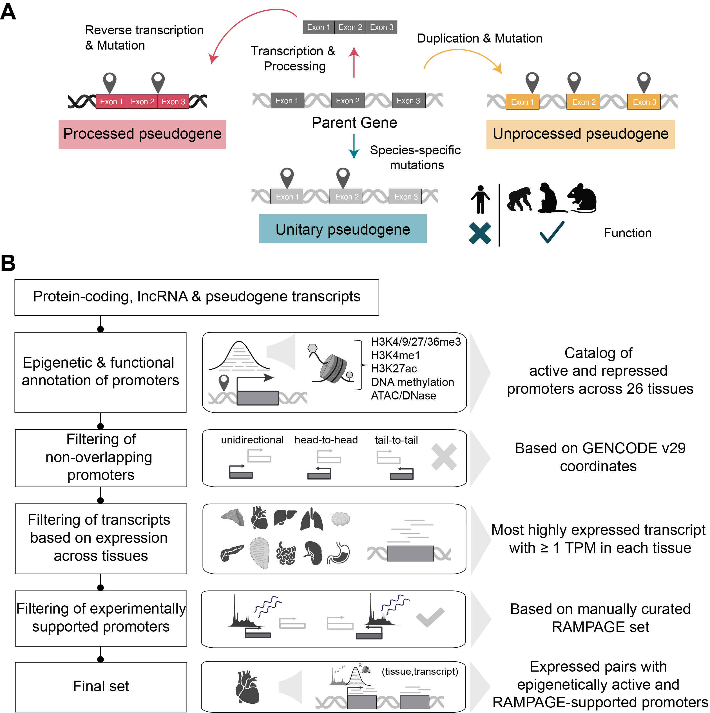

# Epigenetic characterization of pseudogenes across human tissues

*Created with BioRender.com.*

## Overview
To address the limited understanding of pseudogene promoter regulation in a tissue-resolved context, we leveraged matched multi-tissue transcriptomic and epigenomic profiles from the ENCODE-GTEx (EN-TEx) project (Rozowsky et al. 2023), spanning 26 adult human tissues. With these data, we first aimed to systematically annotate the epigenetic status of promoters associated with protein-coding genes, lncRNAs, and pseudogenes, generating a publicly available resource to facilitate exploration of the regulatory landscape of pseudogenes. Then, using this framework, we turned to investigate potential differences in epigenetic patterns between protein-coding genes and pseudogene transcripts, as well as among different pseudogene biotypes. 

Mining this dataset, we identified distinct epigenetic patterns not only between protein-coding and pseudogene transcripts but also among different pseudogene biotypes. In particular, we show that even when expressed, processed pseudogenes lack canonical active histone marks and chromatin accessibility at their promoters. We further demonstrate that these differences reflect both how pseudogenes are formed and where they reside in the genome. Processed pseudogenes do not inherit upstream promoter sequences from their parent genes, yet their upstream regions reside in more evolutionarily conserved sequences and exhibit association with distinct transposable elements and transcription factors. These results define distinct promoter architectures for expressed processed pseudogenes and motivate testable hypotheses for how they can be transcribed despite limited canonical promoter-associated activation, providing a framework for investigating their regulatory and potential functional roles in the human genome.

## For more information
If you have additional questions, please contact [Yunzhe Jiang](mailto:yunzhe.jiang@yale.edu) and [Beatrice Borsari](mailto:beatrice.borsari@gmail.com).
